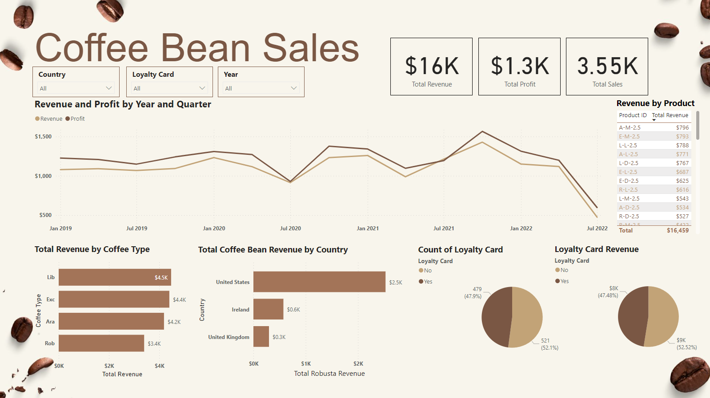

### Project Description

This project aims to examine coffee beans sales for a fictional coffee bean wholesaler. The sales data, provided by [Saad Haroon](https://www.kaggle.com/datasets/saadharoon27/coffee-bean-sales-raw-dataset) via Kaggle, covers the period from 2019 to 2022. The primary objective is to delve into this sales data, focusing on revenue, profit, and customer sales data. Through SQL and Power BI, we seek to uncover sales trends and offer valuable insights into the data."

#### File Organization 

*Notebook - SQL*
- CoffeeBeanSales.sql

*Dashboard - PowerBI*
- CoffeeBeanSales.pbix

*Data Files*
- ~$Raw Data.xlsx
- customer.xlsx
- orders.xlsx
- product.xlsx

Data Source: https://www.kaggle.com/datasets/saadharoon27/coffee-bean-sales-raw-dataset

  

### Analysis

#### Data Collection

The Coffee Bean Sales raw dataset was provided by Kaggle user Saad Haroon. Initial **customer.xlsx**, **orders.xlsx**, and **product.xlsx** were all in one workbook call **~$Raw Data.xlsx**. To facilitate analysis in SQL Server, I used a Microsoft Excel VBA command to split these sheets into individual workbooks, which were then imported into SQL Server.

#### SQL Analysis

During the initial SQL analysis, the focus was on gaining an understanding of the data and performing some necessary reformatting. To enhance the readability of the analysis, the 'Order Date' column was reformatted from a DATETIME to a DATE data type.

After formatting, all three tables joined together using a LEFT JOIN and resulting query was stored into a temporary table (**#CoffeeSales**). This table includes only the columns necessary for the analysis.

From the **#CoffeeSales** table, I examined total revenue, profit as well as using PARTITION to identify products with the highest average revenue alongside their total revenue. 

To better understand the profit margin withing each product, I created a CASE statement for a quick overview of products that were high profit, moderate profit and low profit. 

Additionally, the analysis delved into understanding sales based on factors like loyalty card membership, countries, coffee types, and roast types. This provided valuable insights into the sources of sales and customer preferences.

#### PowerBi Dashboard

Below dashboard is created with the initial SQL join statement. 
The dashboard includes a line graph comparing revenue and profit, a quick summary of revenue, profit and sales numbers, total revenue of each product and revenue breakdown for each category groups. 

Analyzing the dashboard, we observe that between 2019 and 2022, there were periods when profit was lower than revenue. This discrepancy may be attributed to higher operating costs. Sales remained consistent, with a peak occurring in late 2021 before a significant decline in sales around July 2022.

Additionally, the majority of sales were from the United States and most coffee products generated revenue exceeding $4,000, with the exception of Robusta coffee beans, which fell below the average.

The dashboard also highlights a nearly equal ratio between the percentage of loyalty cardholders and revenue earned from cardholders.

From this dashboard, our fictional coffee bean wholesaler gains valuable insights into sales data. They can assess aspects such as the viability of maintaining a loyalty program, considering the operating costs involved. The funds saved from potential cost reductions might be strategically redirected toward marketing campaigns, especially in the U.S., which is the primary revenue source.